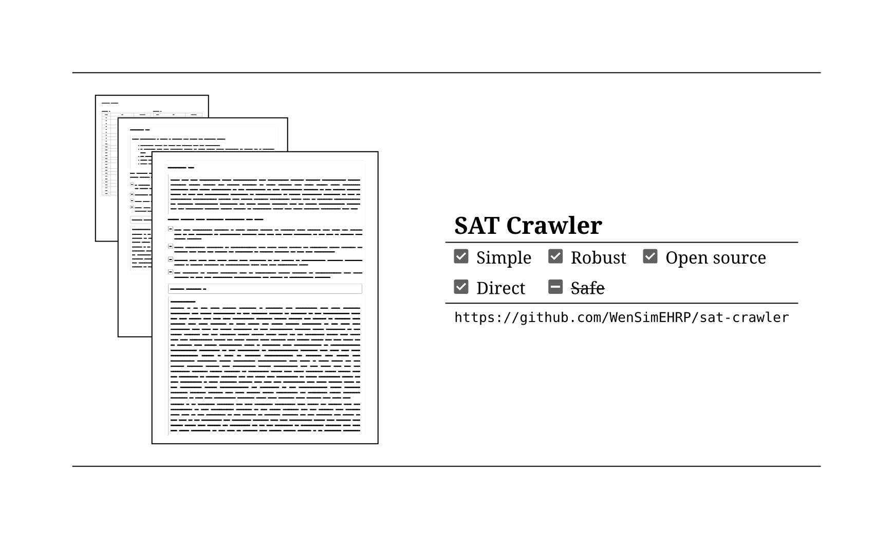

- `crawl.py` - download test data
- `make_html.py` - generate the HTML practice test

Use `./make_html.py --help` for potentially undocumented features.

> [!IMPORTANT]
> To generate a PDF, open the generated `.html` file, use your browser's
> "print" option (usually accessible using the shortcut `<ctrl>` + `p`),
> then choose "Print to PDF" or "Save to PDF", depending on what the print
> menu provides, and select your desired paper size.
>
> Some "Print to PDF" or "Save to PDF" services might automatically add extra
> information in the generated PDF output. Usually there would be an option
> in your browser's print window to hide those unwanted info.
>
> Note that when using a non-Chromium based browser (e.g. Firefox), the page
> numbers on the bottom of each page in the PDF may not show up correctly.
> In this case you may want to install a chromium based browser
> (e.g. MS Edge, Google Chrome, Chromium) to get the correct output.

- Fetching questions: `crawl.py`
- Randomly select questions & make html/pdf output: `make_html.py`
  - Specify output file name using `--output`.
  - Answers:
    - `--answers-only`: only generate the answers html/pdf.
    - `--no-answers`: don't generate any answers.

- Examples:
  - `./make_html.py --output questions --no-answers`
    - Set output prefix to "questions".
    - Don't generate answers.
  - `./make_html.py --output abcde --answers-only`
    - Set output prefix to "abcde".
    - Only generate answers.
  - `./make_html.py`
    - Default output prefix (questions).
    - Generate answers _and_ questions.

## Installing Dependencies

For pdf and html appearance consistency, please install the font [`noto-serif`](https://fonts.google.com/noto/specimen/Noto+Serif).

Install dependencies via `pip3 install -r requirements.txt`.

### Using Nix

Use `nix-shell` to enter the development environment.
